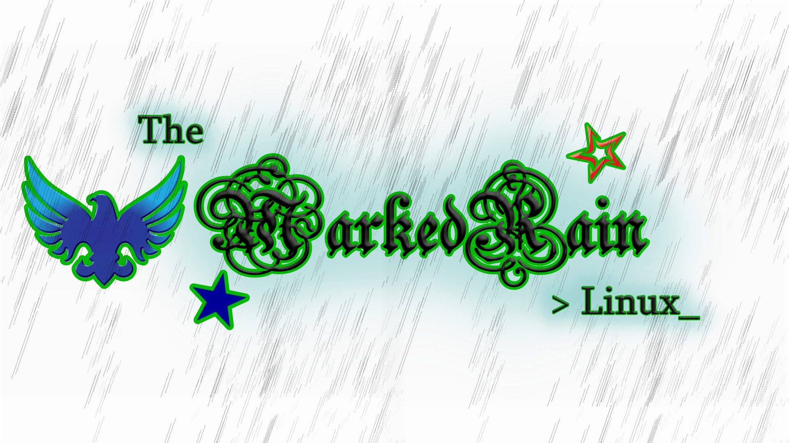
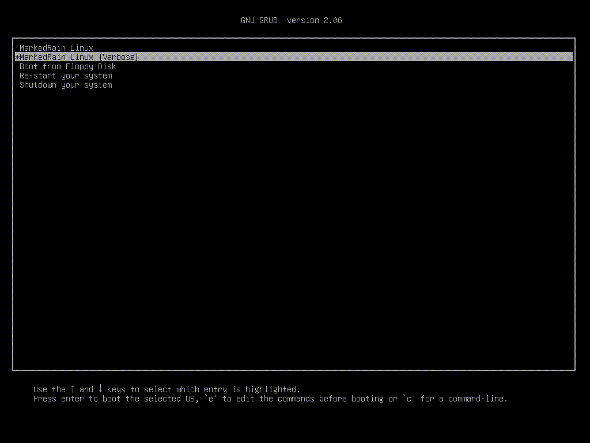
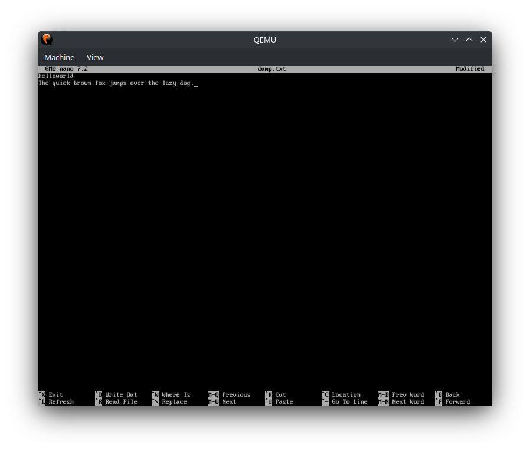

# "MarkedRain" Operating System

The "MarkedRain" is a new linux OS that uses buildroot with OpenRC as init. It is really easy to work with. There was an older system based on Os2020, but working with nothing proved difficult.

## Showcase

## Compiling

Install dependencies for 'make' & 'menuconfig', then run "make menuconfig". Configure as per you desire, then you can either do "make" on the root directory, or go to "source/buildroot" and run menuconfig there, to configure its options, and then run "make" on the root directory, not on buildroot's directory.

View "docs/building.md" for other make options.

